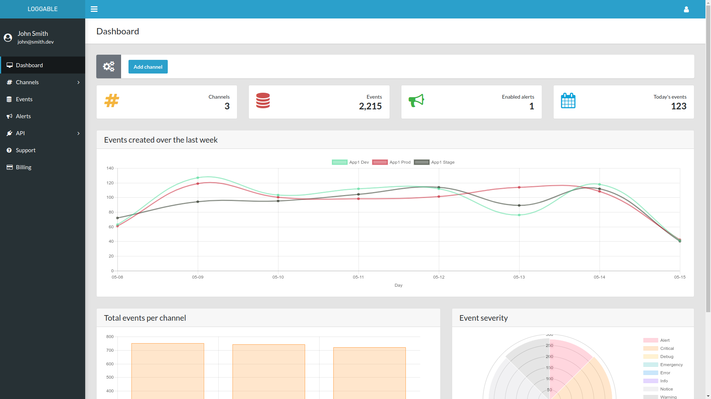
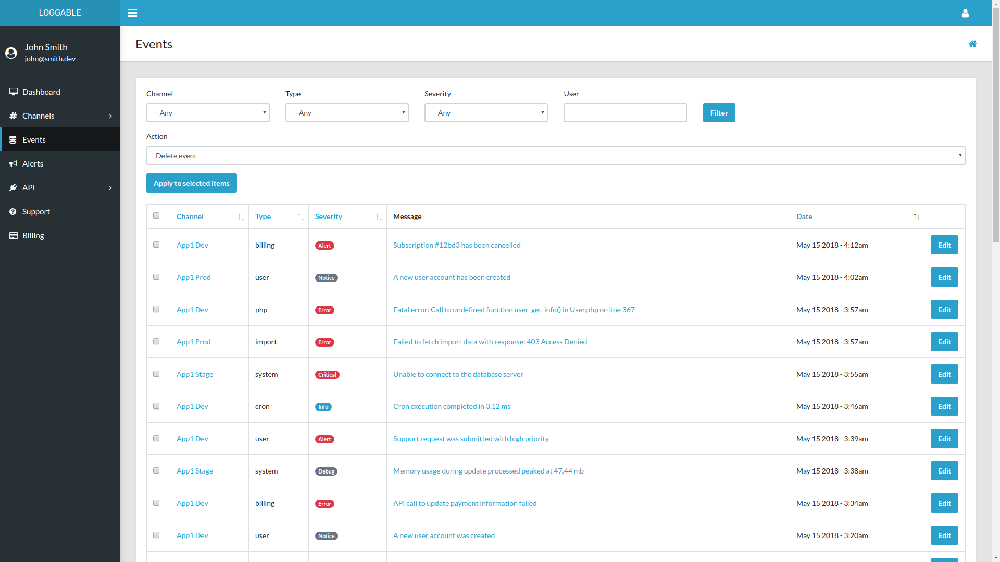
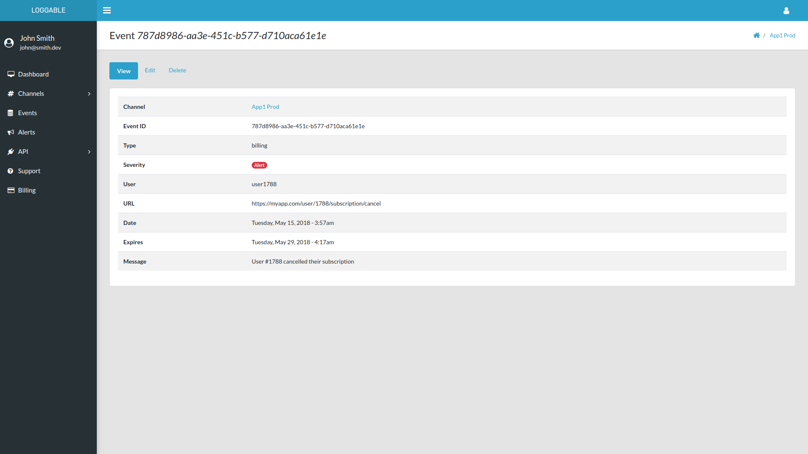
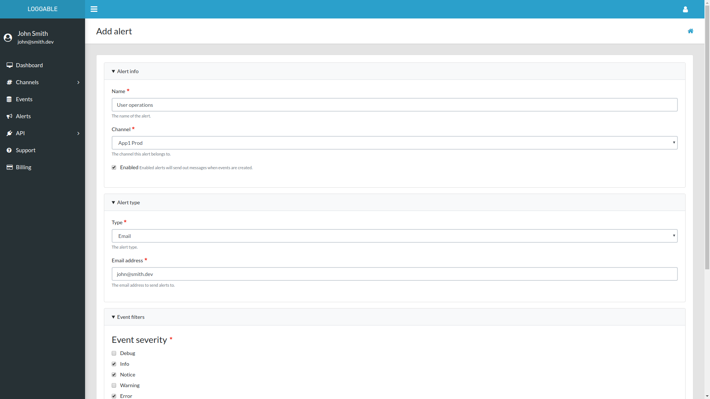

# Loggable

Loggable is a comprehensive, centralized solution for administrative event logging and alerting; providing both a back and front-end. Easily store, view, filter and manage your admin events across all of your channels in a single place; whether you need to add logging capabilities to a single application or you're looking to save time and resources by centralizing your admin log management.

Loggable also provides rule-based alerts so you can be notified when events are logged that meet the exact criteria that you specify. This allows you to decide who gets notified, for which events, and how. Notification options include email, Slack, and webhooks. Additional integrations cab easily be added.

Loggable can be used in isolation for your organization, or using the included module, made in to a SaaS, along with subscription-based billing via Stripe.com.

Built with Drupal 8.

## Installation

Being a Drupal 8 distribution, this can be installed the same way you would any Drupal site.

The easiest way to install is using [Docksal](https://docksal.io/). Once you have Docksal installed on your computer, from within the root of this repo, execute `fin init`. Once the installation is complete, navigate to `loggable.docksal/` in your browser and login using `admin:admin`.

## Screenshots









## API

### Endpoints

JSON:API endpoints are located at `api/events` and `api/channels`. Only events can be created via API.

### Create events

`POST` to `api/events`:

```
{
 "data":{
  "type":"event",
   "attributes": {
     "type":"test",
     "severity":"notice",
     "user":"admin",
     "url":"http://mysite.com",
     "message":"Hello world!"
   },
   "relationships": {
     "channel": {
      "data":{
       "type":"channel",
        "id":"d47d7a1a-71a3-40b1-8a48-f73a6e996ca7"
      }
     }
   }
 }
}
```

### Authentication

All API requests require authentication with a key. To generate or get your key, while logged in, navigate to "API", then "Key authentication" on the nav sidebar.

Add the key to all requests, by including the following query on the URL, ie: `?api-key=30518e894957496c4f7934f936bff3dd`.

## Alert plugins

Included are alert plugins for email, webhook and Slack. To add more, create an `AlertType` plugin by implementing the `AlertTypeBase` class.

## Client

A client module for Drupal is available [here](https://www.drupal.org/project/loggable). This allows you to send select admin events from a Drupal site to Loggable. Note, that you can send events to Loggable from any source, not just Drupal. See the API details above.

## SaaS/Billing

To setup Loggable as a SaaS, with paid-subscriptions for users:
* Enabled the `beacon_billing` module.
* Configure Stripe integration at `/admin/config/stripe`.
* Configure additional billing settings at `/admin/structure/subscription/settings`.
* Individual subscriptions can be viewed and managed at: `/admin/structure/subscription`.

Included are 3 subscription plans: basic, standard, and advanced. Each have different quotas and limitations. They are implemented as `SubscriptionPlan` plugins which implement `SubscriptionPlanBase`.

Sales tax rates can be stores within `beacon_billing/data/tax_rates.csv`.

## Maintenance

This was launched as a SaaS and discontinued in 2018. I've made this code open source but haven't done any development since and do not plan on continuing to maintain and work on the code.

## Credits

* (Vali Admin)[https://github.com/pratikborsadiya/vali-admin] theme by (Pratik Borsadiya)[https://github.com/pratikborsadiya], ported to Drupal.